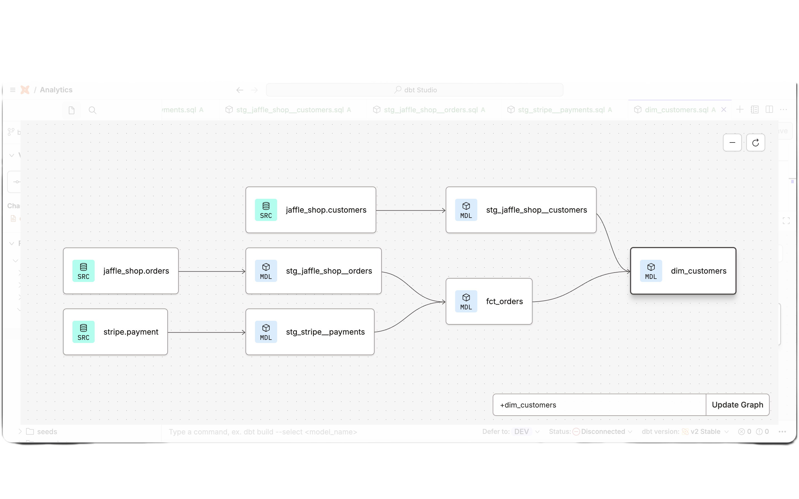

# dbt + Snowflake: Jaffle Shop Analytics Pipeline

An ELT pipeline that loads raw e-commerce and payment data into Snowflake and transforms it into analytics-ready models with dbt. Built as part of the dbt Fundamentals course (dbt Labs).

## Stack
Snowflake · dbt (v2) · SQL · Git / GitHub

## Architecture
```
Snowflake: raw                  staging (views)                     marts (tables)
├── jaffle_shop.customers  →  stg_jaffle_shop__customers  ─────────────┐
├── jaffle_shop.orders     →  stg_jaffle_shop__orders     ──┐          ├→  dim_customers
└── stripe.payment         →  stg_stripe__payments        ──┴→ fct_orders ┘
```

 

## Project structure
```
├── snowflake_setup.sql          # warehouse, databases, schemas, S3 data load
├── dbt_project.yml              # staging as views, marts as tables
├── models/
│   ├── staging/
│   │   ├── _sources.yml         # source definitions + freshness checks
│   │   ├── _staging.yml         # model docs + data tests
│   │   ├── stg_jaffle_shop__customers.sql
│   │   ├── stg_jaffle_shop__orders.sql
│   │   └── stg_stripe__payments.sql
│   └── marts/
│       ├── fct_orders.sql       # one row per order with successful payment total
│       └── dim_customers.sql    # one row per customer with order history + lifetime value
└── tests/
    └── assert_positive_total_for_payments.sql
```

## What's included
- **Snowflake setup:** XSMALL warehouse with auto-suspend, `raw` and `analytics` databases, data loaded from S3 with `COPY INTO`
- **Staging layer:** column renaming, cents-to-dollars conversion, one model per source table
- **Marts:** `fct_orders` aggregates successful payments per order; `dim_customers` adds first/last order date, order count and lifetime value
- **Data tests (9):** `unique`, `not_null`, `accepted_values` on order status, `relationships` between orders and customers, plus a custom test asserting no negative payment totals
- **Source freshness:** configured on `orders._etl_loaded_at` (warns on this static sample data, which is expected)
- **Documentation:** model and column descriptions, lineage via dbt docs

## Run it
1. Run `snowflake_setup.sql` in a Snowflake worksheet
2. Connect dbt to Snowflake with your own credentials (not included in this repo)
3. Build models and run tests:
```bash
   dbt build
```
4. Check source freshness and generate docs:
```bash
   dbt source freshness
   dbt docs generate
```

## Credential
[dbt Fundamentals — dbt Labs](https://credentials.getdbt.com/7e922238-0194-4c53-8665-0ce1da3829aa#acc.U2rbtBNy)